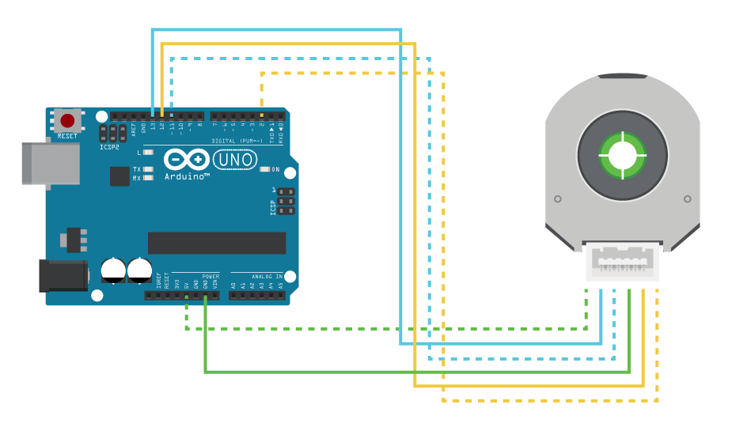

# VCU
## ***Vehicle Control Unit STM32 Project for 2022-2023***
 - Uses an STM32F072 dev board
 - Uses an AM223b optical encoder over SPI to read the pedal position
 - Connects over CAN to the motor controller

## ***Setting up the STM32F072 Boards***

##### This image was taken from [CUI Electronics Guide](https://www.cuidevices.com/product/resource/sample-code/amt22)
## The image above shows the pins for the ardunio microcontroller, however, the STM32F072 board includes arduino pins. This means connectiong to the STM32 board instead of the arduino is just as simple as translating pinouts.

## The IOC file within this projects includes the pins that will be utilized by SPI. For this project SPI will use PA6 - SCK, PA7 - MISO, PA8 - MOSI.

##### AMT223-b datasheet can be found [here](https://www.cuidevices.com/product/resource/amt22.pdf)

## ***Connecting to a Can Line***

## The IOC file within this projects includes the pins that will be utilized by CAN. For this project it is PA11 - RX and PA12 - TX.
### The full CAN Documentation can be found [here](\lib\can-lib\README.md)

## ***Reading and Displaying Data***

